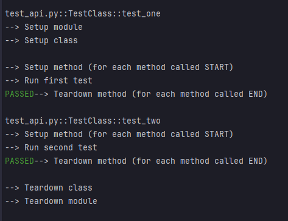

# Python tests: Importance of clean test environment

Writing tests in Python is vital for maintaining code reliability and catching bugs early. Tests serve as a safety net, ensuring that code behaves as expected, promoting faster development cycles, and providing confidence during code changes and collaborations.

In this repo, I want to introduce `setup` and `teardown` in the context of testing.

## Table of Contents

- [Getting Started](#getting-started)
  - [Prerequisites](#prerequisites)
- [Running Tests](#running-tests)
- [What is Setup and Teardown?](#what-is-setup-and-teardown)
- [Sources](#sources)


## Getting Started

### Prerequisites

To run the projects, you need to have Python installed.
I'm using Python 3.12 for these examples.

Some dependencies are required:
- pytest

```bash
# Installing prerequisites
pip install -r requirements.txt
```

## Running Tests

Run basically the test

```bash
# Example for running tests
pytest
```

To have more details for the test you can add

```bash
pytest --verbose -s
```
`-s` is a shortcut for --capture=no

## What is Setup and Teardown?

`setup` and `teardown` refer to the preparation and cleanup activities that are required to execute tests.

**Setup** involves creating or configuring the resources and conditions required for your tests. It helps ensure that the test environment is ready for each specified test.

This can include initializing required classes, database or network connections, defining test objects, fixtures, or variables, and so on.

**Teardown** means to clean up or reset the resources and conditions set up during the setup phase. Simply put, it means gracefully undoing the changes you made to the environment in order to execute your test code.

The most flexible and powerful setup/teardown mechanism in Pytest is the fixture system. In the following sections, we'll talk about fixtures and how to use them for setup and teardown.

## Results

When you launch the test, you'll see the order of each specific method when it's called.

For setup, start method name with keyword `setup_` and then add if it's for module or class

```py
def setup_module(module):
    print("\n--> Setup module")

class TestClass:
    @classmethod
    def setup_class(cls):
        print("--> Setup class")

    def setup_method(self, method):
        print("\n--> Setup method (for each method called START)")
```

For teardown, start method name with keyword `teardown_` and then add if it's for module or class

```python
def teardown_module(module):
    print("--> Teardown module")


class TestClass:
    @classmethod
    def teardown_class(cls):
        print("\n--> Teardown class")

    def teardown_method(self, method):
        print("--> Teardown method (for each method called END)")
```

Result:



## Sources

https://pytest-with-eric.com/pytest-best-practices/pytest-setup-teardown/